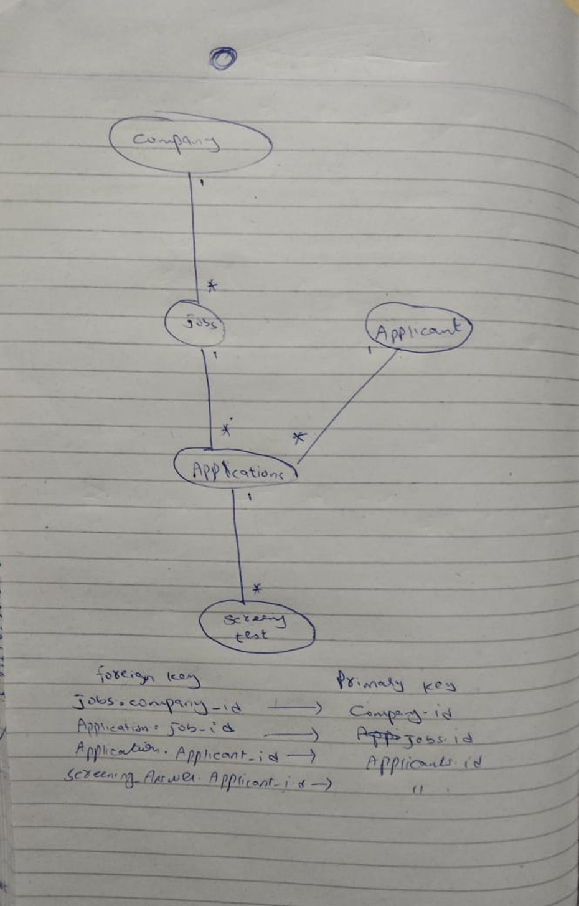

Q1:
Why this database, for this project. In 3–4 sentences, explain why you chose a relational database for your job portal. Name the two job-portal requirements that drove it hardest, and why those two specifically.

Ans:
in this project everything is linked like 
A job is always linked to a company.
An application is  job (and also a real applicant).
A screening answer must always belong to a valid application.
we have to fulfil the requirement of ownership of data(no invalid or orphan relationship) and all or nothing property.
ACID transactions are required to ensure that an application is never partially saved, never lost, and never duplicated.

Q2:
Where you'd lose — and why you still don't switch. Name one honest case in your portal where a pure document model would genuinely fit better (think about the wildly varying job attributes, or high-volume "job viewed" events). Then explain why you still don't add a second database for it.
Ans:
suppose we have diff type of fileds like engineering,sales job ,design job. these fields are different from each other. here mongo db fits better.
but we do not add a 2nd db here because postreSQL already provide this facility of JSONB.	

    ----------------Part B — The topics you just learned

1. Relational vs Document

A relational database stores data in tables with fixed structure (rows and columns), and it strictly enforces relationships like links between tables. A document database stores data as flexible JSON-like objects, where each record can have a different structure. In relational databases, rules like relationships and data correctness are enforced by the database itself, while in document databases, many of these checks are handled by the application code.

2. Transactions & Atomicity

A transaction is a group of database operations that are treated as one single unit — either everything happens or nothing happens. In a job portal, when an applicant applies from a shortlist, multiple things happen together like creating applications, saving answers, and taking a snapshot of the resume. Atomicity means all of this must succeed together, otherwise nothing is saved. Without it, you could end up with a half-saved application (for example, answers saved but no application created, or one job applied successfully and another missing).

3. Foreign Keys & Referential Integrity

A foreign key ensures that a value in one table must match an existing record in another table. For example, applications.job_id → jobs.id means every application must point to a real job. Because of this rule, the database will not allow an application to be created with a fake or missing job_id. It will also not allow a job to be deleted if applications still exist for it (unless special rules like cascade delete are set).

4. Joins

A join is a way to combine related data from two or more tables using matching columns.
One common screen in a job portal is the “applications list for a recruiter,” which uses applications, jobs, and applicants tables. Without joins, you would need many separate queries to fetch related data (like job title and applicant name), which would make the system slow and inefficient.

5. JSONB Hybrid

PostgreSQL allows you to store normal structured data in columns and flexible data in a JSONB field inside the same table. This gives you both strict rules and flexibility.

For a jobs table:

Real columns:
id, company_id → because they define relationships and must be strictly enforced
JSONB attributes:
tech_stack, salary_range → because they vary from job to job and are mostly used for display or filtering

This way, important data stays strict, and flexible data stays adaptable.

